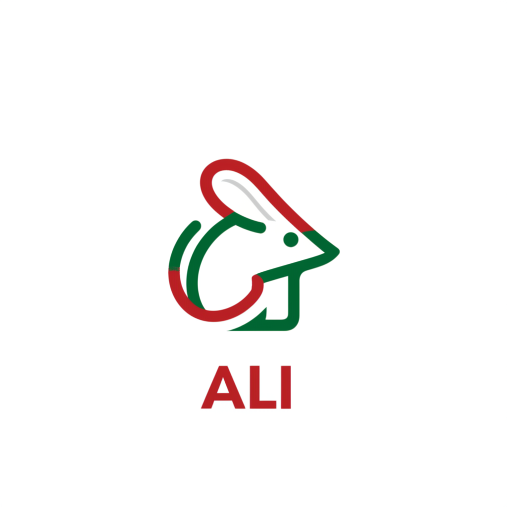

<p align="center">
  <a href="#"></a>
</p>

## About

Ali is designed as a minimal, composable foundation for building LLM-powered
applications in Go. It focuses on small interfaces, explicit configuration,
and compatibility across providers. The implementation has zero dependencies
outside Go's standard library.

## Quick Start

#### session.Talk

[ali.Session](./session/session.go) maintains conversation history and
context across multiple requests. A session stores conversation history
in memory and automatically includes prior messages on each [Talk](session/session.go)
call. It is transport/provider-neutral and works with any [ali.Provider](ali.go).
The following example implements a simple **R**ead **E**val **P**rint **L**oop
with the help of the [ali.Session](./session/session.go):

```go
package main

import (
	"bufio"
	"fmt"
	"os"

	"github.com/0x1eef/ali"
	"github.com/0x1eef/ali/provider"
	"github.com/0x1eef/ali/session"
)

func main() {
	p, err := provider.New(ali.Gemini)
	if err != nil {
		panic(err)
	}

	ses, err := session.New(p)
	if err != nil {
		panic(err)
	}

	scanner := bufio.NewScanner(os.Stdin)
	for {
		fmt.Print("> ")
		if !scanner.Scan() {
			break
		}

		prompt := scanner.Text()
		if prompt == "/exit" {
			break
		}

		c, err := ses.Talk(ali.WithPrompt(prompt))
		if err != nil {
			panic(err)
		}

		text, err := c.Text()
		if err != nil {
			panic(err)
		}
		fmt.Println(text)
	}
}
```

#### session.{Save,Restore}

A session can be saved to disk and afterwards restored via the
[Session.Save](session/session.go) and
[Session.Restore](session/session.go)
methods. Going further &ndash;
a session can be written to any io.Writer and read from any io.Reader
via the [session.WriteTo](session/session.go) and [session.ReadFrom](session/session.go)
methods.

This opens the door for more than just writing to or reading from files on disk,
and creates possibilities like storing a session in a database of some kind &ndash;
for example, a JSONB column in a PostgreSQL database would be perfect:

```go
package main

import (
	"github.com/0x1eef/ali"
	"github.com/0x1eef/ali/provider"
	"github.com/0x1eef/ali/session"
)

func main() {
	p, err := provider.New(ali.OpenAI)
	if err != nil {
		panic(err)
	}

	ses, err := session.New(p)
	if err != nil {
		panic(err)
	}

	messages := []string{
		"Greetings.",
		"I have something important to tell you.",
		"The truth circulates with him wherever he goes.",
	}
	for _, m := range messages {
		_, err := ses.Talk(ali.WithPrompt(m))
		if err != nil {
			panic(err)
		}
	}

	if err := ses.Save("session.json"); err != nil {
		panic(err)
	}
}
```


## Features

#### Architecture

* 🧩 Small, focused interfaces
* 🔄 Provider-agnostic abstractions
* ⚙️ Explicit configuration
* 🚫 No global state

#### Providers

* 🌐 OpenAI, Gemini, and Anthropic providers
* 🔌 Automatic environment-based token loading via [provider.New](provider/provider.go)
* 🧱 Direct provider constructors via [openai.New](openai/openai.go) and friends
* 🛰️ Support for providers with an OpenAI-compatible API via [openai.WithHost](openai/config.go)

#### Requests

* 🗂️ Stateless one-shot completions via [ali.Provider.Complete](ali.go)
* 🛠️ Composable request options via [ali.WithPrompt](config.go), [ali.WithRole](config.go) and friends
* 🖼️ Image generation via [ali.Provider.Images](ali.go)

#### Sessions

* 💬 In-memory multi-turn conversations via [session.Session](session/session.go)
* 🔁 Conversation continuity via [session.Talk(...)](session/session.go)
* 💾 Session persistence via [session.Save](session/session.go), [session.Restore](session/session.go), and friends

#### Completions

* 📊 Unified completion access (`Text`, `InputTokens`, `OutputTokens`, `TotalTokens`)
* 🔎 Raw provider response access with `Raw()`

#### Dependencies

* 📦 Zero dependencies outside Go standard library


## Examples

#### ali.Provider

All providers implement the [ali.Provider](ali.go) interface, which serves as
the foundation for the rest of the toolkit. This ensures a consistent,
provider-agnostic API that allows implementations to be easily swapped.
The [provider.New](provider/provider.go) function returns a type that implements
the [ali.Provider](ali.go) interface and automatically reads the corresponding
API token from the process environment.

For example &ndash; `$OPENAI_SECRET`, `$GEMINI_SECRET`, or `$ANTHROPIC_SECRET`:

```go
package main

import (
	"github.com/0x1eef/ali"
	"github.com/0x1eef/ali/provider"
)

func main() {
	p, err := provider.New(ali.OpenAI)
	if err != nil {
		panic(err)
	}
	// do something with 'p'
}
```

If explicit configuration is required, a provider can be constructed directly
instead of using [provider.New](provider/provider.go). The example will use
OpenAI but it could also be Anthropic or Gemini instead. It is a little bit more verbose
and sometimes harder to work with &ndash; that's the main reason why
[provider.New](provider/provider.go) exists in the first place:

```go
package main

import (
	"github.com/0x1eef/ali/openai"
)

func main() {
	p, err := openai.New(
		openai.WithToken("yourtoken"),
	)
	if err != nil {
		panic(err)
	}
	// do something with 'p'
}
```

#### Context

Every kind of request that Ali makes can be covered by the [context](https://pkg.go.dev/context)
package, and this can give the caller greater control over the requests
that Ali makes. For example, and perhaps most common, a context can be used
to implement a request timeout that results in an error when the limit
naturally expires:

```go
package main

import (
	"context"
	"fmt"
	"time"

	"github.com/0x1eef/ali"
	"github.com/0x1eef/ali/provider"
)

func main() {
	ctx, cancel := context.WithTimeout(context.Background(), 5*time.Second)
	defer cancel()

	p, err := provider.New(ali.Gemini)
	if err != nil {
		panic(err)
	}

	c, err := p.Complete(
		ali.WithPrompt("I am Ali"),
		ali.WithContext(ctx),
	)
	if err != nil {
		panic(err)
	}

	text, err := c.Text()
	if err != nil {
		panic(err)
	}
	fmt.Printf("LLM says:\n%s\n", text)
}
```

#### Complete

All providers implement a [Complete](ali.go) method that accepts a
variable number of options and returns a [ali.Completion](ali.go)
interface that is common across all providers. This method is stateless
and does not carry state between method calls.  See [config.go](./config.go)
for a list of all available options, and see the [next example](#session)
that introduces sessions for how to maintain state between method calls.

The following example sends a simple prompt and prints the text response to
the terminal:

```go
package main

import (
	"fmt"

	"github.com/0x1eef/ali"
	"github.com/0x1eef/ali/provider"
)

func main() {
	p, err := provider.New(ali.OpenAI)
	if err != nil {
		panic(err)
	}

	c, err := p.Complete(
		ali.WithPrompt("I am the city of knowledge and Ali is its gate"),
	)
	if err != nil {
		panic(err)
	}

	text, err := c.Text()
	if err != nil {
		panic(err)
	}
	fmt.Printf("LLM says:\n%s\n", text)
}
```

#### Images

The [ali.Provider.Images](ali.go) method provides image generation capabilities
for the providers that support it. The following example uses Gemini, and the
[imagen](https://ai.google.dev/gemini-api/docs/imagen) model to generate an image
from a prompt that is then written to disk:

```go
package main

import (
	"fmt"
	"os"

	"github.com/0x1eef/ali"
	"github.com/0x1eef/ali/image"
	"github.com/0x1eef/ali/provider"
)

func main() {
	p, err := provider.New(ali.Gemini)
	if err != nil {
		panic(err)
	}

	images, err := p.Images().Create(
		image.WithPrompt("I am the city of knowledge and Ali is its gate"),
		image.WithQuantity(1),
	)
	if err != nil {
		panic(err)
	}

	for i, img := range images {
		f, err := os.Create(fmt.Sprintf("%d.png", i+1))
		if err != nil {
			panic(err)
		}
		defer f.Close()
		_, err = f.ReadFrom(img)
		if err != nil {
			panic(err)
		}
	}
}
```

## Sources

* [github.com/@0x1eef](https://github.com/0x1eef/ali#readme)
* [codeberg.org/@0x1eef](https://codeberg.org/0x1eef/ali)

## License

[BSD Zero Clause](https://choosealicense.com/licenses/0bsd/)
<br>
See [LICENSE](./LICENSE)
